## SXU Online Judge

### 初步计划

1. 轻量级模块开发，易于部署和后期维护。

2. 前后端分离，提高效率。

3. 支持多机器多进程判题，判题更高效。

4. 多语言支持：C/C++/Golang/Java/Python2/Python3。

5. 支持Special Judge、选择题和函数题。

6. 包含算法题库，供用户日常练习。

7. oj可定期举办线上比赛，实时排名，赛后评定，获取相应的积分。

8. 比赛可设置多种赛制(ACM/OI)。

9. 设置用户讨论区，便于用户经验交流。

10. 实时爬取并显示用户Codeforces rating。

11. 增加用户名，讨论区内容审核功能，防止出现不良言论。

#### 模块组成

分为以下三部分：

fronted：普通用户界面和管理员后台界面。

backed：处理用户常规请求、判断用户提交代码类型分给不同的测评机并获取结果。

judger：安全的编译运行用户提交的代码，记录程序完成测试样例所需的时间和空间。

#### 技术要求

Web 的技术栈：

- 前端使用 Vue 框架。

- 后端使用 [Gin](https://gin-gonic.com/zh-cn) 框架。

- [GORM](https://gorm.io/zh_CN/)

中间件：

- Redis

容器技术：

- Docker Compose

团队协作：

- Git
- Coding

其他：

* gRPC
* libseccomp 
* ptrace
* linux namespace
* cgroup
